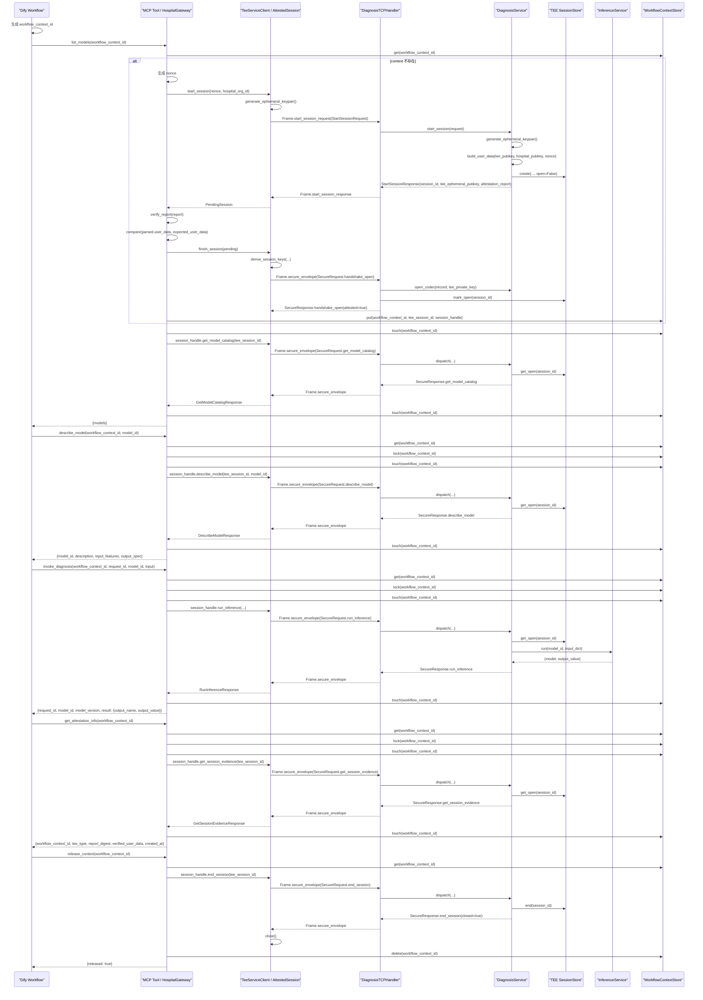

# MedAssist

一期原型包含两个独立服务：

- `apps/hospital_mcp`：医院侧 MCP Server
- `apps/tee_service`：云侧 CSV TEE 安全会话服务

两边采用“**先 CSV 远程认证，再建立安全会话**”的流程通信。bootstrap 通道只承载 `StartSession` 和 attestation report，TEE 的可信性只在医院侧验证 report 成功后成立。

## 目录

- `apps/hospital_mcp`：医院侧入口
- `apps/tee_service`：TEE 侧入口
- `shared/attestation`：CSV attestation 共享封装
- `shared/proto`：protobuf 消息定义
- `shared/secure_channel.py`：X25519、HKDF、AES-GCM 会话封装
- `shared/transport.py`：长度前缀 TCP frame 收发
- `shared/schemas`：registry 驱动的通用输入校验与编码
- `models`：ONNX 模型和注册表
- `scripts`：开发脚本

## 环境准备

要求：

- Python 3.10+
- `uv`
- 真实 CSV 环境运行 TEE 服务时，需要存在 `/dev/csv-guest`

兼容性说明：

- Python 3.10 环境会安装 `onnxruntime<1.24`
- Python 3.11 及以上会安装较新的 `onnxruntime`

安装依赖：

```bash
uv sync --extra dev
```

生成示例 ONNX 模型：

```bash
uv run medassist-build-model
```

环境文件说明：

- 代码本身只读取环境变量，不会自动扫描 `.env` 文件
- `.env.tee.example` 和 `.env.hospital.example` 只是配置模板
- 真正生效的是 `uv run --env-file <配置文件>` 这一步，`uv` 会先把文件内容注入成环境变量，再启动服务
- 配置文件名不是固定的，下面使用 `.env.tee` 和 `.env.hospital` 只是为了便于区分

复制模板文件：

```bash
cp .env.tee.example .env.tee
cp .env.hospital.example .env.hospital
```

## 两台机器部署

### 1. TEE 主机

参考配置文件：

- `.env.tee.example`

关键变量：

- `MEDASSIST_TEE_HOST`
- `MEDASSIST_TEE_PORT`
- `MEDASSIST_MODEL_REGISTRY`
- `MEDASSIST_SESSION_TTL_SECONDS`

示例：

```bash
cp .env.tee.example .env.tee
# 编辑 .env.tee
uv run --env-file .env.tee medassist-tee
```

### 2. 医院主机

参考配置文件：

- `.env.hospital.example`

关键变量：

- `MEDASSIST_MCP_PORT`
- `MEDASSIST_TEE_TARGET`
- `MEDASSIST_HOSPITAL_ORG_ID`
- `MEDASSIST_CONTEXT_TTL_SECONDS`
- `MEDASSIST_TEE_TIMEOUT_SECONDS`

示例：

```bash
cp .env.hospital.example .env.hospital
# 编辑 .env.hospital
uv run --env-file .env.hospital medassist-mcp
```

说明：

- `MEDASSIST_TEE_TARGET` 是医院侧指定 TEE 服务地址的地方，格式是 `ip:port`
- 医院侧 MCP 默认监听端口是 `9123`
- 配置文件中的相对路径默认按项目根目录解析
- `models/registry.json` 里的 `artifact_uri` 如果写相对路径，则按 `registry.json` 所在目录解析
- `MEDASSIST_TEE_TIMEOUT_SECONDS` 控制医院侧 TCP 连接和收发超时
- 医院侧 `MEDASSIST_CONTEXT_TTL_SECONDS` 控制本地 workflow context 的滑动过期时间，默认 `10800` 秒
- TEE 侧 `MEDASSIST_SESSION_TTL_SECONDS` 控制服务端 secure session 的滑动过期时间，默认 `11400` 秒
- 这一轮通过拉长 TTL 来降低长流程被误清理的概率，不是机制级修复；正常流程仍然建议在 workflow 末尾调用 `release_context`
- 如果 workflow 异常退出或遗漏 `release_context`，本地 context 和 TEE session 可能最长保留约 3 小时
- 当前一期不依赖业务 CA、mTLS 或服务端证书来判断 TEE 可信性

## 交互时序

下面这版时序图对应当前代码实现：Dify 不再显式管理 `tee_session_id`，而是通过 `workflow_context_id` 让医院侧 MCP 内部托管真实 TEE 安全会话。



具体流程如下：

1. Dify 在工作流开始时生成一个稳定的 `workflow_context_id`。  
2. Dify 调用 `list_models(workflow_context_id)` 或其他业务工具。  
3. 医院侧 MCP 先查本地 `workflow_context_id -> tee_session_id + session_handle` 映射。  
4. 如果这个 context 第一次出现，MCP 会内部自动发起一次 TEE attestation 和建链。  
5. 医院侧 MCP 生成本次会话的 `nonce` 和医院侧临时公钥。  
6. 医院侧 MCP 向 TEE 发送 `StartSessionRequest`。  
7. TEE 服务生成 TEE 临时公钥，并把 `SHA256(tee_ephemeral_pubkey || hospital_ephemeral_pubkey || nonce)` 写入 attestation 的 `UserData`。  
8. TEE 服务返回 `tee_session_id`、`tee_ephemeral_pubkey` 和 `attestation_report`。  
9. 医院侧 MCP 验证 attestation report，并校验 `UserData` 绑定关系。  
10. 医院侧 MCP 派生会话密钥，发送加密 `HandshakeOpen`。  
11. TEE 成功解密后把该 `tee_session_id` 标记为 `open`。  
12. 医院侧 MCP 在本地缓存 `workflow_context_id -> tee_session_id + session_handle`。  
13. 同一个 `workflow_context_id` 下的后续 `list_models / describe_model / invoke_diagnosis / get_attestation_info` 都复用这条内部安全连接。  
14. 每次成功调用后，医院侧 MCP 会刷新本地 context 的滑动 TTL。  
15. TEE 侧在每次成功 secure request 后也会刷新服务端 session 的滑动 TTL。  
16. Dify 调用 `describe_model(workflow_context_id, model_id)` 获取输入字段、单位、允许值和输出说明。  
17. Dify 按 `describe_model` 返回的 `input_features` 构造 `input` 字典。  
18. Dify 调用 `invoke_diagnosis(workflow_context_id, request_id, model_id, input)` 发起推理。  
19. TEE 服务按 `models/registry.json` 定义的 `input_features` 在运行时校验并编码输入。  
20. TEE 服务执行 ONNX 推理，并返回 `output_name` 和 `output_value`。  
21. Dify 如需展示证明摘要，可调用 `get_attestation_info(workflow_context_id)`。  
22. 工作流结束时，Dify 调用 `release_context(workflow_context_id)` 做 best-effort 清理。  
23. 医院侧 MCP 向 TEE 发送 `EndSessionRequest`，然后关闭本地 socket 并删除本地 context 映射。  
24. 如果底层连接中途断开，医院侧 MCP 会删除该 context，并返回 `workflow_context_id ... is no longer active; restart the workflow context`。  

## 当前接口

医院侧 MCP 暴露 5 个工具：

- `list_models`
- `describe_model`
- `invoke_diagnosis`
- `get_attestation_info`
- `release_context`

TEE 侧 bootstrap/secure session 业务消息包括：

- `StartSession`
- `HandshakeOpen`
- `GetModelCatalog`
- `DescribeModel`
- `RunInference`
- `GetSessionEvidence`
- `EndSession`

## Dify 推荐调用顺序

在 Dify 中，推荐按下面顺序调用 MCP：

1. 在 workflow 开始节点生成 `workflow_context_id`
2. `list_models(workflow_context_id)`
3. `describe_model(workflow_context_id, model_id)`
4. `invoke_diagnosis(workflow_context_id, request_id, model_id, input)`
5. 可选：`get_attestation_info(workflow_context_id)`
6. `release_context(workflow_context_id)`

`list_models` 的第一次调用会自动触发内部 attestation 和建链；`describe_model` 用来获取 Dify 真正需要的字段说明，包括输入特征、单位、允许值、结果语义和结果范围。
如果中途收到 `workflow_context_id ... is no longer active; restart the workflow context`，说明底层安全连接已经失效，需要为这轮 workflow 重新生成一个新的 `workflow_context_id` 并重新开始。
`invoke_diagnosis` 的 `input` 参数是一个普通 JSON 对象，字段名和值都以 `describe_model` 返回的 `input_features` 为准，而且列出的字段都必须提供。
当前实现不会在服务启动时额外校验 ONNX 输入输出契约，相关问题会在实际推理时暴露。

`list_models(workflow_context_id)` 当前会返回：

- `model_id`
- `display_name`
- `version`
- `engine`
- `summary`

`describe_model(workflow_context_id, model_id)` 当前会返回类似：

```json
{
  "model_id": "cardio-risk-v1",
  "display_name": "Cardio Risk v1",
  "version": "1.0.0",
  "engine": "onnxruntime",
  "summary": "Structured heart disease risk model with 9 clinical input features.",
  "description": "Estimates a heart disease risk probability from structured cardiovascular features. The output risk_score is a 0 to 1 probability-like score where larger values indicate higher risk.",
  "input_features": [
    {
      "name": "age",
      "label": "Age",
      "type": "number",
      "unit": "years",
      "description": "Patient age.",
      "allowed_values": []
    },
    {
      "name": "sex",
      "label": "Sex",
      "type": "enum",
      "unit": "category",
      "description": "Biological sex used by the demo model.",
      "allowed_values": ["female", "male"]
    }
  ],
  "output_spec": {
    "name": "risk_score",
    "label": "Risk Score",
    "type": "number",
    "description": "Heart disease risk probability produced by the demo model. The value is between 0.0 and 1.0, and lower values indicate lower risk.",
    "range_min": 0.0,
    "range_max": 1.0
  }
}
```

## 测试

运行测试：

```bash
.venv/bin/pytest
```

## 说明

当前仓库包含一个最小演示 ONNX 模型：

- `models/cardio-risk-v1.onnx`

默认示例 registry 中的：

- `artifact_uri: "cardio-risk-v1.onnx"`

表示模型文件相对 `models/registry.json` 所在目录解析。

当前推理返回结果是单值数值结果：

- `output_name`：来自 `output_spec.name`
- `output_value`：模型返回的原始单值数值结果
