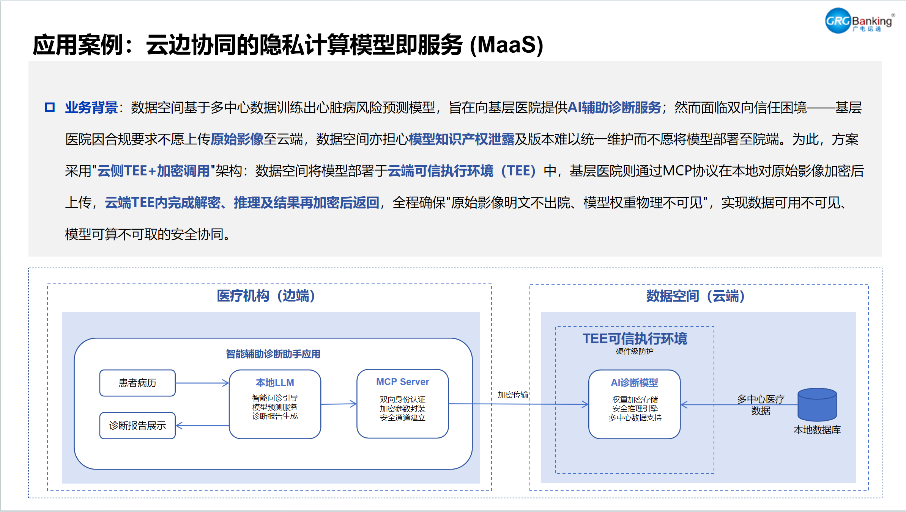
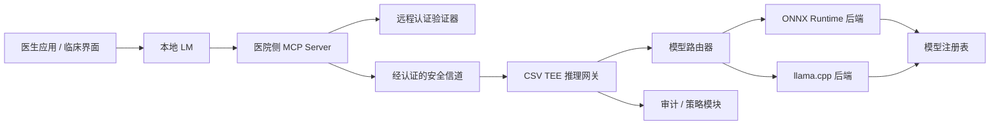
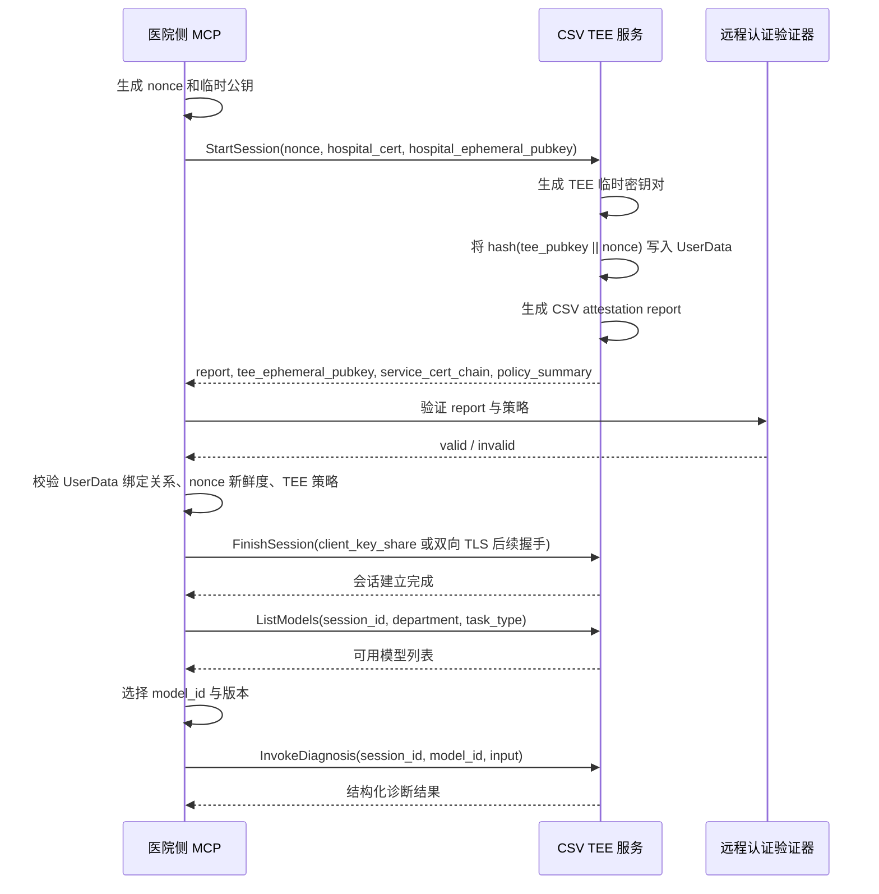

# MCP + CSV TEE 医疗诊断服务设计草案

## 1. 目标

本文将当前架构设想整理为一份可落地的设计草案，覆盖以下内容：

- 医院侧 MCP Server
- 运行在海光 CSV TEE 内的云侧 AI 诊断服务
- 远程认证与安全信道建立流程
- 模型运行时与模型管理策略

目标场景如下：

- 医院尽可能将原始医疗数据保留在本地
- 数据空间将诊断模型部署在云侧 CSV TEE 中
- 医院在发送受保护请求前，能够先验证 TEE 的可信性
- 所有模型请求与返回结果都通过经过认证的安全信道传输

## 2. 推荐运行时方案

### 2.1 一期推荐方案

建议在 CSV TEE 内使用如下技术栈：

- 服务层：`gRPC server` 或 `FastAPI`
- 主推理引擎：`ONNX Runtime`
- 可选小模型适配器：`llama.cpp`
- 模型注册表：本地 manifest 文件或 SQLite

原因如下：

- 海光 CSV 本质上更像一个受保护的 Linux 虚拟机，因此常规 Linux 推理软件可以直接运行
- ONNX Runtime 非常适合 CPU 推理，能较好支持多类导出后的模型
- 一个统一服务进程即可按 `model_id` 将请求路由到不同后端
- 如果后续需要支持小型 GGUF 大模型，可以单独增加 `llama.cpp`，而不必强行让一个引擎承载所有模型类型

### 2.2 关于“是否能加载不同模型”

严格来说，不存在一个真正“通吃所有格式且无需转换”的通用推理引擎。

更实用的做法是：

- 将大部分预测类模型统一为 `ONNX`
- 将小型 LLM 统一为 `GGUF`
- 对外暴露统一服务接口
- 在服务内部按后端类型进行路由

建议支持的内部模型类型如下：

- `onnxruntime`：结构化数据模型、图像模型、小型 NLP 模型
- `llamacpp`：小型医疗问答模型、诊断解释模型、报告辅助生成模型

## 3. 角色与信任边界

### 3.1 医院侧

组件包括：

- 医生工作站或临床应用
- 本地 LM，用于交互与报告生成
- 医院侧 MCP Server
- 医院身份凭据存储
- 本地审计日志

职责包括：

- 向云侧服务证明医院机构身份
- 执行远程认证结果验证
- 建立安全会话
- 加密并发送推理请求
- 解密响应结果，并将结构化输出交给本地 LM
- 记录审计日志

### 3.2 云侧

组件包括：

- CSV TEE 客体操作系统
- TEE 推理服务
- 模型文件与元数据
- 可选的 TEE 内本地数据库
- 可选的 KMS 或密钥下发服务，用于模型解密

职责包括：

- 产生远程认证证据
- 证明自身启动状态和运行状态符合预期
- 在 TEE 内终止安全信道
- 加载模型文件
- 执行推理并返回结构化结果

### 3.3 非可信区域

以下部分应默认视为不可信或不完全可信：

- 云主机操作系统
- Hypervisor
- 位于 TEE 外部的普通入口代理
- 医院与云之间的公有或私有网络

因此必须满足：

- TLS 终止必须发生在 TEE 内
- 远程认证结果必须与会话密钥绑定

## 4. 目标架构



## 5. 会话建立与远程认证流程

### 5.1 设计原则

- 远程认证未成功前，不允许发起诊断请求
- 认证结果必须绑定到一个新鲜的 challenge
- 认证报告必须绑定到 TEE 的临时公钥
- 后续全部业务流量都必须走已经建立好的受认证安全信道

### 5.2 推荐时序



### 5.3 医院侧必须校验的内容

医院侧验证逻辑至少应覆盖：

- 认证报告本身是否合法
- 报告是否由预期的 CSV 平台信任链生成
- TEE 是否处于非调试模式
- TEE 是否处于要求的独享保护模式
- 度量值或摘要是否命中白名单
- `UserData` 是否与预期绑定值一致
- `nonce` 是否足够新鲜，是否存在重放

根据公开 CSV 示例文档，`UserData` 是可配置的，因此完全可以用来绑定公钥摘要或其他会话材料。

### 5.4 推荐的 `UserData` 绑定方式

建议将以下摘要写入 `UserData`：

```text
SHA256(
  tee_ephemeral_pubkey ||
  client_nonce
)
```

这样医院侧可以确认：

- 当前 TEE 提供的临时公钥属于已认证的 TEE 会话
- 认证是为本次请求新生成的，而不是旧报告重放

模型选择应放在远程认证成功之后，再通过安全会话内的模型目录查询与调用流程完成，而不是放进 `UserData` 绑定材料里。

## 6. 安全信道选择

### 6.1 首选方式

首选建议为：

- `gRPC over TLS 1.3`
- 双向认证
- 将远程认证结果绑定到 TLS 会话密钥或证书

### 6.2 更强、更标准化的方式

如果环境允许，建议进一步采用：

- `RATS-TLS`

原因如下：

- 它专门面向带远程认证能力的安全通信
- 开源实现中已经列出了 CSV 对应的 attester/verifier 能力
- 设计思想与机密计算场景下的可信传输模型高度一致

### 6.3 实际落地建议

为了控制一期复杂度，建议分两阶段：

- 一期：`mTLS + 外部远程认证校验 + UserData 绑定`
- 二期：演进到 `RATS-TLS`

这样可以先把正确的信任模型落下去，同时避免一期实现过重。

## 7. 医院侧 MCP 设计

### 7.1 定位

医院侧 MCP Server 不应只是一个普通代理。

它应该充当“本地可信网关”，负责：

- 处理远程认证和会话建立
- 在任何云侧调用前执行策略校验
- 将上层业务请求转换为安全服务请求
- 统一接入审计和访问控制

### 7.2 建议的 MCP 工具接口

#### `attest_open_session`

用途：

- 发起远程认证
- 建立经过认证的安全会话

请求示例：

```json
{
  "nonce": "base64-encoded-random",
  "hospital_identity": {
    "org_id": "hospital-a",
    "cert_ref": "cert://hospital-a-client-cert"
  }
}
```

响应示例：

```json
{
  "session_id": "sess_123456",
  "attestation_summary": {
    "verified": true,
    "tee_type": "csv"
  },
  "expires_at": "2026-04-03T10:30:00Z"
}
```

#### `list_models`

用途：

- 在已经建立的安全会话中，返回当前医院有权限调用的模型清单

请求示例：

```json
{
  "session_id": "sess_123456",
  "department": "cardiology",
  "task_type": "risk_prediction"
}
```

响应示例：

```json
{
  "models": [
    {
      "model_id": "cardio-risk-v1",
      "version": "1.2.0",
      "engine": "onnxruntime"
    }
  ]
}
```

#### `invoke_diagnosis`

用途：

- 通过已建立的安全会话发起推理或诊断请求

请求示例：

```json
{
  "session_id": "sess_123456",
  "request_id": "req_abc001",
  "model_id": "cardio-risk-v1",
  "input": {
    "age": 63,
    "sex": "male",
    "chest_pain_type": "asymptomatic",
    "resting_bp": 145,
    "cholesterol": 233,
    "fasting_blood_sugar": 1,
    "max_heart_rate": 150,
    "exercise_angina": 0,
    "oldpeak": 2.3
  }
}
```

响应示例：

```json
{
  "request_id": "req_abc001",
  "model_id": "cardio-risk-v1",
  "model_version": "1.2.0",
  "result": {
    "risk_score": 0.82
  }
}
```

#### `get_attestation_info`

用途：

- 返回当前会话的认证摘要信息，供审计或界面展示

#### `close_session`

用途：

- 关闭安全会话并清理会话密钥

### 7.3 MCP 内部模块建议

建议拆分如下内部模块：

- `identity_manager`
- `attestation_verifier`
- `secure_channel_manager`
- `policy_engine`
- `request_marshaler`
- `audit_logger`
- `model_capability_cache`

## 8. 云侧 TEE 服务设计

### 8.1 服务拆分

建议在 TEE 内部按职责拆分为：

- `diag-gateway`：网络入口、身份校验、会话管理
- `model-router`：按 `model_id` 路由到对应后端
- `onnx-worker`：ONNX Runtime 推理执行
- `llm-worker`：如有需要，调用 llama.cpp 执行小模型推理
- `audit-agent`：可信审计日志整理与输出

### 8.2 模型注册表结构

建议的模型元数据结构如下：

```json
{
  "model_id": "cardio-risk-v1",
  "model_version": "1.2.0",
  "backend": "onnxruntime",
  "artifact_uri": "/models/cardio-risk-v1/model.onnx",
  "artifact_sha256": "...."
}
```

### 8.3 服务 API 建议

建议使用：

- 内部服务契约采用 `gRPC`

建议 RPC 包括：

- `GetModelCatalog`
- `StartSession`
- `CompleteSession`
- `RunInference`
- `GetSessionEvidence`
- `EndSession`

### 8.4 为什么推荐 gRPC

- 相比裸 JSON，更适合定义医疗模型输入输出结构
- 更利于版本演进
- 若后续需要支持大图片分块传输或流式结果，也更方便扩展
- 更容易生成客户端 SDK

## 9. 输入输出边界建议

### 9.1 原始数据最小化原则

默认不要“一股脑把所有数据都上传”。

优先传输：

- 结构化临床特征
- 去标识化后的患者标识
- 必要的图像区域或派生特征

如果后续场景确实需要传输完整医疗影像：

- 也必须在远程认证成功后再开始上传
- 通过受认证安全信道执行分块加密传输

### 9.2 输出风格建议

云侧模型返回结果应尽量是结构化输出，而不是自由文本。

建议输出形式如下：

```json
{
  "risk_score": 0.82
}
```

之后再由医院侧本地 LM 将其转换为：

- 风险等级
- 面向医生的解释
- 面向患者的总结
- 诊断报告草稿

这样做的好处是：

- 降低云侧模型知识产权暴露面
- 将解释与报告生成能力尽量保留在医院本地

## 10. 会话与密钥生命周期

建议采用如下策略：

1. 每个会话使用短生命周期会话密钥。
2. 每次会话建立都绑定新的 nonce。
3. 空闲会话尽快过期，例如 10 到 30 分钟。
4. 新建会话时重新进行远程认证。
5. 会话关闭或超时后，及时清理内存中的密钥材料。

明确不建议：

- 多家医院长时间复用同一组传输密钥
- 允许业务请求退化到未认证的备用通道
- 在 TEE 外终止 TLS

## 11. 模型加载策略

### 11.1 是否支持加载不同模型

可以支持，但必须是“受控加载”，而不是任意加载。

建议做法：

- 每个模型都带上元数据、摘要、输入输出 schema、后端类型
- 所有模型纳入可信模型注册表
- 只允许加载白名单模型
- 每个模型绑定独立策略

### 11.2 安全路由逻辑示例

```text
if backend == "onnxruntime":
    use ONNX Runtime session
elif backend == "llamacpp":
    use llama.cpp context
else:
    reject request
```

### 11.3 运维建议

对于第一版系统，建议：

- 服务启动时预加载一个或少量审批通过的模型

后续再逐步演进到：

- 在完成签名校验和摘要校验后，支持受控热加载

## 12. 一期最小可行范围

一版可落地的最小实现建议包含：

- 一个医院侧 MCP Server
- 一个云侧 TEE 诊断网关
- 一条 CSV 远程认证校验链路
- 一个 `cardio-risk-v1` ONNX 模型
- 一条安全会话建立流程
- 一套结构化结果 schema
- 每次会话和每次推理调用各一条审计记录

一期尽量避免：

- 一开始就支持过多模型类型
- 如果结构化特征足够，就不要先上完整影像流传输
- 做成复杂的多租户动态模型市场
- 在 TEE 外部堆太多复杂编排组件

## 13. 需要进一步确认的问题

在正式实现前，建议明确以下事项：

- 医院身份认证采用 mTLS 证书
- 模型文件是直接明文存放在 TEE 镜像中
- 远程认证验证器是完全放在医院 MCP 内部
- 一期医院仅上传结构化特征
- 最终协议是一阶段先用 mTLS 绑定方案

## 14. 下一步推荐产出

建议下一步直接产出以下工程文档或原型：

1. 云侧诊断服务的 protobuf 契约定义
2. 医院侧 MCP 工具接口 schema
3. 一份 attestation 文档，阿里云的 attestation 样例代码在本地目录，你可以参考下。
4. 一个在 CSV 中运行 ONNX 模型的最小服务原型
5. 一条完整演示链路：`attest -> open session -> infer -> audit -> close`
